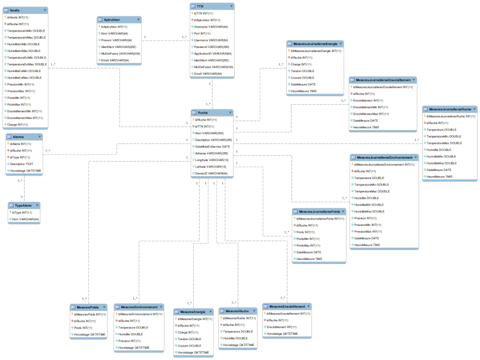

# Le projet Bee-Honey't 2019

- [Le projet Bee-Honey't 2019](#le-projet-bee-honeyt-2019)
  - [Auteurs](#auteurs)
  - [Description](#description)
  - [Productions](#productions)
  - [Vidéos](#vidéos)
  - [Base de données MySQL](#base-de-données-mysql)
  - [Licence GPL](#licence-gpl)

## Auteurs

- Clément LAURAIN <laurain.clement.contact@gmail.com>
- Florentin MELLAH <florentinmellah@gmail.com>
- Enzo ROSSI <enzo.rossi13160contact@gmail.com>

## Description

Système autonome permettant de connaître à distance certains paramètres d'une ruche afin d'assurer son suivi et d'évaluer la santé des abeilles.

## Productions

- [dossier-beehoneyt-ir-2019.pdf](dossier-beehoneyt-ir-2019.pdf)
- [refman-beehoneyt.pdf](refman-beehoneyt.pdf)
- [presentation-laurain-2019.pdf](presentation-laurain-2019.pdf)
- [presentation-mellah-2019.pdf](presentation-mellah-2019.pdf)
- [presentation-rossi-2019.pdf](presentation-rossi-2019.pdf)

Documentation du code : https://btssn-lasalle-84.github.io/bee-honey-t-2019/

## Vidéos

- https://www.youtube.com/watch?v=kFLROLy1jgk
- https://www.youtube.com/watch?v=gB9Lq5uawBs

## Base de données MySQL



```sql
--
-- Base de données: `ruches`
--

DROP DATABASE IF EXISTS `ruches`;

CREATE DATABASE IF NOT EXISTS `ruches`;

USE `ruches`;

-- --------------------------------------------------------

--
-- Structure de la table `Apiculteur`
--

CREATE TABLE IF NOT EXISTS `Apiculteur` (
  `idApiculteur` int(11) NOT NULL AUTO_INCREMENT,
  `Nom` varchar(64) NOT NULL,
  `Prenom` varchar(64) NOT NULL,
  `Identifiant` varchar(255) DEFAULT NULL,
  `MotDePasse` varchar(255) DEFAULT NULL,
  `Email` varchar(64) NOT NULL,  
  PRIMARY KEY (`idApiculteur`)
) ENGINE=InnoDB DEFAULT CHARSET=utf8;

INSERT INTO `Apiculteur` (`Nom`,`Prenom`,`Identifiant`,`MotDePasse`,`Email`) VALUES('Vaira','Thierry','tvaira','5f4dcc3b5aa765d61d8327deb882cf99','tvaira@free.fr');
INSERT INTO `Apiculteur` (`Nom`,`Prenom`,`Identifiant`,`MotDePasse`,`Email`) VALUES('Soulie','Jean','jsoulie','','');

-- --------------------------------------------------------

--
-- Structure de la table `TTN`
--

CREATE TABLE IF NOT EXISTS `TTN` (
  `idTTN` int(11) NOT NULL AUTO_INCREMENT,
  `idApiculteur` int(11) NOT NULL,
  `Hostname` varchar(64) NOT NULL,
  `Port` int(11) NOT NULL,
  `Username` varchar(64) NOT NULL,
  `Password` varchar(255) DEFAULT NULL,
  `ApplicationID` varchar(64) NOT NULL,
  `Identifiant` varchar(255) DEFAULT NULL,
  `MotDePasse` varchar(255) DEFAULT NULL,
  `Email` varchar(64) NOT NULL,  
  PRIMARY KEY (`idTTN`),
  CONSTRAINT TTN_fk_1 FOREIGN KEY (`idApiculteur`) REFERENCES Apiculteur(`idApiculteur`) ON DELETE CASCADE
) ENGINE=InnoDB DEFAULT CHARSET=utf8;

INSERT INTO `TTN` (`idApiculteur`, `Hostname`,`Port`,`Username`,`Password`,`ApplicationID`,`Identifiant`,`MotDePasse`,`Email`) VALUES('2','eu.thethings.network',1883,'mes_ruches','ttn-account-v2.vC-aqMRnLLzGkNjODWgy81kLqzxBPAT8_mE-L7U2C_w','mes_ruches','fmellah','ruches123','florentinmellah@gmail.com');

-- --------------------------------------------------------

--
-- Structure de la table `Ruche`
--

CREATE TABLE IF NOT EXISTS `Ruche` (
  `idRuche` int(11) NOT NULL AUTO_INCREMENT,
  `idTTN` int(11) NOT NULL,
  `Nom` varchar(255) NOT NULL,
  `Description` varchar(255) DEFAULT NULL,
  `DateMiseEnService` date NOT NULL,
  `Adresse` varchar(255) DEFAULT NULL,
  `Longitude` varchar(15) DEFAULT NULL,
  `Latitude` varchar(15) DEFAULT NULL,
  `DeviceID` varchar(64) NOT NULL,
  PRIMARY KEY (`idRuche`),
  UNIQUE (`DeviceID`),
  CONSTRAINT Ruche_fk_1 FOREIGN KEY (`idTTN`) REFERENCES TTN(`idTTN`) ON DELETE CASCADE
) ENGINE=InnoDB DEFAULT CHARSET=utf8;

INSERT INTO `Ruche` (`idTTN`,`Nom`,`Description`,`DateMiseEnService`,`Adresse`,`Longitude`,`Latitude`,`DeviceID`) VALUES('1','Ruche 1','...','2015-03-29','','-4.5°', '43.9°','ruche_1');

-- --------------------------------------------------------

--
-- Structure de la table `Seuils`
--

CREATE TABLE IF NOT EXISTS `Seuils` (
  `idSeuils` int(11) NOT NULL AUTO_INCREMENT,
  `idRuche` int(11) NOT NULL,
  `TemperatureIntMin` double NOT NULL,
  `TemperatureIntMax` double NOT NULL,
  `HumiditeIntMin` double NOT NULL,
  `HumiditeIntMax` double NOT NULL,
  `TemperatureExtMin` double NOT NULL,
  `TemperatureExtMax` double NOT NULL,
  `HumiditeExtMin` double NOT NULL,
  `HumiditeExtMax` double NOT NULL,
  `PressionMin` int(11) NOT NULL,
  `PressionMax` int(11) NOT NULL,
  `PoidsMin` int(11) NOT NULL,
  `PoidsMax` int(11) NOT NULL,
  `EnsoleillementMin` int(11) NOT NULL,
  `EnsoleillementMax` int(11) NOT NULL,
  `Charge` int(11) NOT NULL,
  PRIMARY KEY (`idSeuils`),
  CONSTRAINT Seuils_fk_1 FOREIGN KEY (`idRuche`) REFERENCES Ruche(`idRuche`) ON DELETE CASCADE
) ENGINE=InnoDB DEFAULT CHARSET=utf8;

INSERT INTO `Seuils` (`idRuche`, `TemperatureIntMin`, `TemperatureIntMax`, `HumiditeIntMin`, `HumiditeIntMax`, `TemperatureExtMin`, `TemperatureExtMax`, `HumiditeExtMin`, `HumiditeExtMax`, `PressionMin`, `PressionMax`, `PoidsMin`, `PoidsMax`, `EnsoleillementMin`, `EnsoleillementMax`, `Charge`) VALUES('1','25','35','20','30','5','35','20','35','1010','1110','10','100','10','1000', '25');

-- --------------------------------------------------------

--
-- Structure de la table `MesuresEnvironnement`
--

CREATE TABLE IF NOT EXISTS `MesuresEnvironnement` (
  `idMesuresEnvironnement` int(11) NOT NULL AUTO_INCREMENT,
  `idRuche` int(11) NOT NULL,
  `Temperature` double NOT NULL,
  `Humidite` double NOT NULL,
  `Pression` int(11) NOT NULL,
  `Horodatage` datetime NOT NULL,
  PRIMARY KEY (`idMesuresEnvironnement`),
  CONSTRAINT MesuresEnvironnement_fk_1 FOREIGN KEY (`idRuche`) REFERENCES Ruche(`idRuche`) ON DELETE CASCADE
) ENGINE=InnoDB DEFAULT CHARSET=utf8;

-- --------------------------------------------------------

--
-- Structure de la table `MesuresEnsoleillement`
--

CREATE TABLE IF NOT EXISTS `MesuresEnsoleillement` (
  `idMesuresEnsoleillement` int(11) NOT NULL AUTO_INCREMENT,
  `idRuche` int(11) NOT NULL,
  `Ensoleillement` int(11) NOT NULL,
  `Horodatage` datetime NOT NULL,
  PRIMARY KEY (`idMesuresEnsoleillement`),
  CONSTRAINT MesuresEnsoleillement_fk_1 FOREIGN KEY (`idRuche`) REFERENCES Ruche(`idRuche`) ON DELETE CASCADE
) ENGINE=InnoDB DEFAULT CHARSET=utf8;

-- --------------------------------------------------------

--
-- Structure de la table `MesuresRuche`
--

CREATE TABLE IF NOT EXISTS `MesuresRuche` (
  `idMesuresRuche` int(11) NOT NULL AUTO_INCREMENT, 
  `idRuche` int(11) NOT NULL,
  `Temperature` double NOT NULL,
  `Humidite` double NOT NULL,
  `Horodatage` datetime NOT NULL,
  PRIMARY KEY (`idMesuresRuche`),
  CONSTRAINT MesuresRuche_fk_1 FOREIGN KEY (`idRuche`) REFERENCES Ruche(`idRuche`) ON DELETE CASCADE
) ENGINE=InnoDB DEFAULT CHARSET=utf8;


-- --------------------------------------------------------

--
-- Structure de la table `MesuresPoids`
--

CREATE TABLE IF NOT EXISTS `MesuresPoids` (
  `idMesuresPoids` int(11) NOT NULL AUTO_INCREMENT, 
  `idRuche` int(11) NOT NULL,
  `Poids` int(11) NOT NULL,
  `Horodatage` datetime NOT NULL,
  PRIMARY KEY (`idMesuresPoids`),
  CONSTRAINT MesuresPoids_fk_1 FOREIGN KEY (`idRuche`) REFERENCES Ruche(`idRuche`) ON DELETE CASCADE
) ENGINE=InnoDB DEFAULT CHARSET=utf8;

-- --------------------------------------------------------

--
-- Structure de la table `MesuresEnergie`
--

CREATE TABLE IF NOT EXISTS `MesuresEnergie` (
  `idMesuresEnergie` int(11) NOT NULL AUTO_INCREMENT, 
  `idRuche` int(11) NOT NULL,
  `Charge` int(11) NOT NULL,
  `Tension` double NOT NULL,
  `Courant` double NOT NULL,
  `Horodatage` datetime NOT NULL,
  PRIMARY KEY (`idMesuresEnergie`),
  CONSTRAINT MesuresEnergie_fk_1 FOREIGN KEY (`idRuche`) REFERENCES Ruche(`idRuche`) ON DELETE CASCADE
) ENGINE=InnoDB DEFAULT CHARSET=utf8;

-- --------------------------------------------------------

--
-- Structure de la table `TypeAlerte`
--

CREATE TABLE IF NOT EXISTS `TypeAlerte` (
  `idType` int(11) NOT NULL AUTO_INCREMENT,
  `Nom` varchar(64) NOT NULL,
  PRIMARY KEY (`idType`)
) ENGINE=InnoDB DEFAULT CHARSET=utf8;

-- --------------------------------------------------------

INSERT INTO `TypeAlerte` (`Nom`) VALUES
('Temperature'),
('Humidite'),
('Poids'),
('Charge');

-- --------------------------------------------------------

--
-- Structure de la table `Alertes`
--

CREATE TABLE IF NOT EXISTS `Alertes` (
  `idAlerte` int(11) NOT NULL AUTO_INCREMENT,
  `idRuche` int(11) NOT NULL,
  `idType` int(11) NOT NULL,  
  `Description` text CHARACTER SET utf8 NOT NULL,
  `Horodatage` datetime NOT NULL,
  PRIMARY KEY (`idAlerte`),
  CONSTRAINT Alertes_fk_1 FOREIGN KEY (`idRuche`) REFERENCES Ruche(`idRuche`) ON DELETE CASCADE,
  CONSTRAINT Alertes_fk_2 FOREIGN KEY (`idType`) REFERENCES TypeAlerte(`idType`) ON DELETE CASCADE
) ENGINE=InnoDB DEFAULT CHARSET=utf8;

--
-- Contenu de la table `Alertes`
--

-- --------------------------------------------------------

--
-- Structure de la table `MesuresJournalieresEnvironnement`
--

CREATE TABLE IF NOT EXISTS `MesuresJournalieresEnvironnement` (
  `idMesuresJournalieresEnvironnement` int(11) NOT NULL AUTO_INCREMENT,
  `idRuche` int(11) NOT NULL,
  `Temperature` double NOT NULL,
  `TemperatureMin` double NOT NULL,
  `TemperatureMax` double NOT NULL,
  `Humidite` double NOT NULL,
  `HumiditeMin` double NOT NULL,
  `HumiditeMax` double NOT NULL,
  `Pression` int(11) NOT NULL,
  `PressionMin` int(11) NOT NULL,
  `PressionMax` int(11) NOT NULL,
  `DateMesure` date NOT NULL,
  `HeureMesure` time NOT NULL,
  PRIMARY KEY (`idMesuresJournalieresEnvironnement`),
  CONSTRAINT MesuresJournalieresEnvironnement_fk_1 FOREIGN KEY (`idRuche`) REFERENCES Ruche(`idRuche`) ON DELETE CASCADE
) ENGINE=InnoDB DEFAULT CHARSET=utf8;

-- --------------------------------------------------------

--
-- Structure de la table `MesuresJournalieresEnsoleillement`
--

CREATE TABLE IF NOT EXISTS `MesuresJournalieresEnsoleillement` (
  `idMesuresJournalieresEnsoleillement` int(11) NOT NULL AUTO_INCREMENT,
  `idRuche` int(11) NOT NULL,
  `Ensoleillement` int(11) NOT NULL,
  `EnsoleillementMin` int(11) NOT NULL,
  `EnsoleillementMax` int(11) NOT NULL,
  `DateMesure` date NOT NULL,
  `HeureMesure` time NOT NULL,
  PRIMARY KEY (`idMesuresJournalieresEnsoleillement`),
  CONSTRAINT MesuresJournalieresEnsoleillement_fk_1 FOREIGN KEY (`idRuche`) REFERENCES Ruche(`idRuche`) ON DELETE CASCADE
) ENGINE=InnoDB DEFAULT CHARSET=utf8;

-- --------------------------------------------------------

--
-- Structure de la table `MesuresJournalieresRuche`
--

CREATE TABLE IF NOT EXISTS `MesuresJournalieresRuche` (
  `idMesuresJournalieresRuche` int(11) NOT NULL AUTO_INCREMENT, 
  `idRuche` int(11) NOT NULL,
  `Temperature` double NOT NULL,
  `TemperatureMin` double NOT NULL,
  `TemperatureMax` double NOT NULL,
  `Humidite` double NOT NULL,
  `HumiditeMin` double NOT NULL,
  `HumiditeMax` double NOT NULL,
  `DateMesure` date NOT NULL,
  `HeureMesure` time NOT NULL,
  PRIMARY KEY (`idMesuresJournalieresRuche`),
  CONSTRAINT MesuresJournalieresRuche_fk_1 FOREIGN KEY (`idRuche`) REFERENCES Ruche(`idRuche`) ON DELETE CASCADE
) ENGINE=InnoDB DEFAULT CHARSET=utf8;


-- --------------------------------------------------------

--
-- Structure de la table `MesuresJournalieresPoids`
--

CREATE TABLE IF NOT EXISTS `MesuresJournalieresPoids` (
  `idMesuresJournalieresPoids` int(11) NOT NULL AUTO_INCREMENT, 
  `idRuche` int(11) NOT NULL,
  `Poids` int(11) NOT NULL,
  `PoidsMin` int(11) NOT NULL,
  `PoidsMax` int(11) NOT NULL,
  `DateMesure` date NOT NULL,
  `HeureMesure` time NOT NULL,  
  PRIMARY KEY (`idMesuresJournalieresPoids`),
  CONSTRAINT MesuresJournalieresPoids_fk_1 FOREIGN KEY (`idRuche`) REFERENCES Ruche(`idRuche`) ON DELETE CASCADE
) ENGINE=InnoDB DEFAULT CHARSET=utf8;

-- --------------------------------------------------------

--
-- Structure de la table `MesuresJournalieresEnergie`
--

CREATE TABLE IF NOT EXISTS `MesuresJournalieresEnergie` (
  `idMesuresJournalieresEnergie` int(11) NOT NULL AUTO_INCREMENT, 
  `idRuche` int(11) NOT NULL,
  `Charge` int(11) NOT NULL,
  `Tension` double NOT NULL,
  `Courant` double NOT NULL,
  `DateMesure` date NOT NULL,
  `HeureMesure` time NOT NULL,
  PRIMARY KEY (`idMesuresJournalieresEnergie`),
  CONSTRAINT MesuresJournalieresEnergie_fk_1 FOREIGN KEY (`idRuche`) REFERENCES Ruche(`idRuche`) ON DELETE CASCADE
) ENGINE=InnoDB DEFAULT CHARSET=utf8;
```

## Licence GPL

This program is free software; you can redistribute it and/or modify
it under the terms of the GNU General Public License as published by
the Free Software Foundation; either version 2 of the License, or
(at your option) any later version.

This program is distributed in the hope that it will be useful,
but WITHOUT ANY WARRANTY; without even the implied warranty of
MERCHANTABILITY or FITNESS FOR A PARTICULAR PURPOSE. See the
GNU General Public License for more details.

You should have received a copy of the GNU General Public License
along with this program; if not, write to the Free Software
Foundation, Inc., 59 Temple Place, Suite 330, Boston, MA 02111-1307 USA
